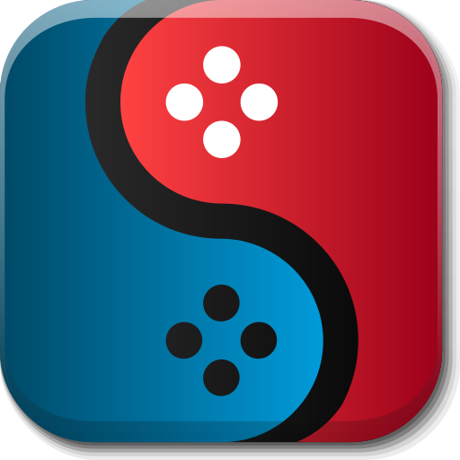
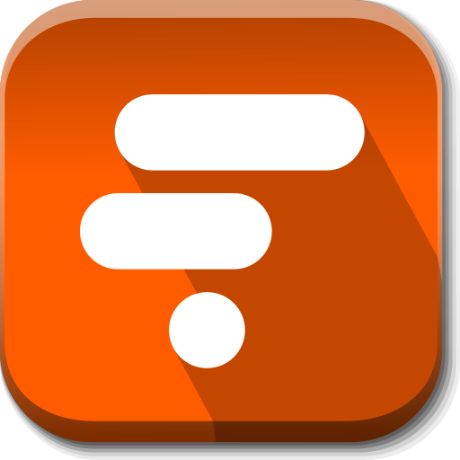
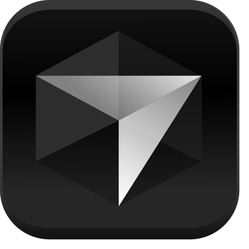
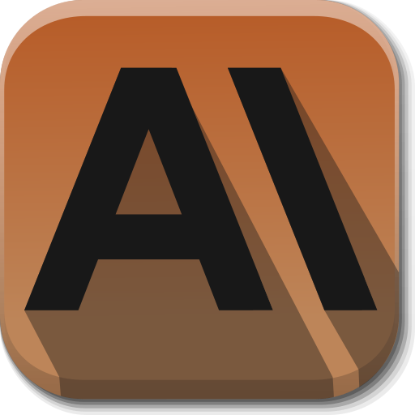

# Funky Square Dance SVG Icon Set

A small but growing set of SVG icons inspired by Alecive's FlatWoken icon set which you can find [here](https://github.com/alecive/FlatWoken). Although originally created as a fork of Alecive's set, I instead decided to focus on icons not in the original Flatwoken set albeit with some subtle but important tweaks.

## Differences

- **Dimensions** - all icons are snapped to the top left of the canvas to maximise the visible area of each icon.
- **Bevel** - some of the buttons have a deeper bevel, others have a slimmer bevel. This is me playing around with some different styles. At some point I'll standardise them all.
- **Inner Shadow** - you may notice that the shadows are all different opacities, angles and gradients. Again, I'll tweak these for consistency at some point once I've decided on an angle and style.

## Tools

Everything was made with Inkscape on Linux; an app that's become a mainstay in my armoury and one that I've really enjoyed learning.

## The Icons

|   |   |    |   |
|---|---|----|---|
|<figure><figcaption>Suyu</figcaption></figure>|<figure><figcaption>HoppScotch</figcaption></figure>|<figure><figcaption>Google Calendar</figcaption></figure>|<figure><figcaption>FollowIs</figcaption></figure>|
|<figure><figcaption>Astro</figcaption></figure>|<figure><figcaption>Cursor</figcaption></figure>|<figure><figcaption>Anthropic</figcaption></figure>|<figure><figcaption>BlueSky</figcaption></figure>

## Next Up

- Gmail
- Thunderbird
- Jellyfin
- Bitwig
- Bitwarden
- InvoiceNinja
- XNview
- Plane
- ChatGPT
- Upwork
- Obsidian